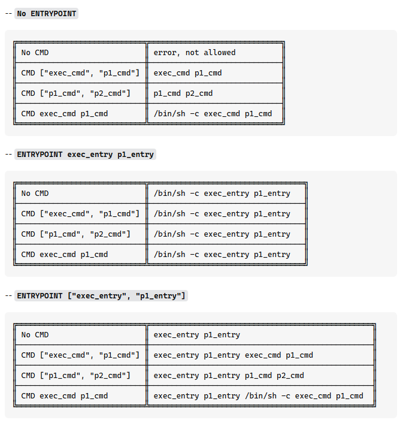

# docker-comparisons-repo
W tym repo omawiamy różne przypadki i będziemy po kolei je omawiać
## Folder Basics
### COPY vs ADD
Obie komendy służą do transportu plików do obrazu
COPY to zwykłe kopiuj, ADD natomiast może skopiować plik z internetu lub rozpakować archiwum, czy pyta o zgodę? Nie, po prostu to robi
```dockerfile
FROM python:3.12-slim

# ADD rozpakuje archiwum lub kopiuje
ADD sample.tar.gz /app/add-sample/
ADD sampletext.txt /app/add-sample/

# COPY kopiuje plik bez rozpakowania
COPY sample.tar.gz /app/copy-sample/
COPY sampletext.txt /app/copy-sample/

CMD ["ls", "-R", "/app"]
```
Wykonaj polecenie:
```bash
docker build -t copy-vs-add -f basics/CopyVsAdd basics
```
A potem przejrzyj logi:
```bash
docker run copy-vs-add
```
Operacji transferu zostały poddane 2 pliki:
- txt, który zawsze jest kopiowany
- archiwum, które jest kopiowane przez COPY, a rozpakowywane przez ADD

### CMD
CMD jest tym co się wykona przy odpaleniu kontenera, ale tylko ostatnie CMD zostanie wykonane:
```
FROM python:3.12-slim

WORKDIR /app

CMD ["echo", "pierwsze CMD"]   # <-- to zostanie ZIGNOROWANE
CMD ["echo", "drugie CMD"]     # <-- to zostanie ZIGNOROWANE
CMD ["echo", "OSTATNIE CMD"]   # ✅ TYLKO TO SIĘ WYKONA
```

Uruchamiając to zobaczymy tylko ostatni CMD, a poprzednie zostaną zignorowane
```bash
docker build -t latestcmd -f basics/Latestcmd basics
```

```bash
docker run latestcmd
```

### ENTRYPOINT vs CMD
Wiemy już, że CMD bierzemy pod uwage tylko ostatnie, a czym to się różni od ENTRYPOINT?

ENTRYPOINT jest tylko jedno i jest wykorzystywane przy uruchomieniu dockera jako pierwsze, a potem może CMD zostanie użyte poniżej jest obrazek z macierzą rozpisek:



My się skupimy na prostym przykładzie:
```dockerfile
FROM python:3.12-slim

ENTRYPOINT ["echo"]
CMD ["domyslny"]
```
I potem zbudujmy:
```bash
docker build -t entry -f basics/Entry basics
```
Mamy kilka opcji wykonania tego kodu:
```bash
docker run entry
```

lub:

```bash
docker run entry ARGMUNENT
```
Zmieni wynik w ten sposób, jeżeli macie kontener, który wykonuje jakąś pracę np przetwarza dane to wystarczy mu podać ścieżkę do źródła, a on przetworzy te dane.

### Warstwy
Docker składa się z warstw, za prawie każdym razem gdy w dodajecie komendę w Dockerfile tworzy to nową warstwę. Warstwa to niejako zmiany naniesione na pewien określony stan(hash). Następnie nowa warstwa ustala nowy hash na podstawie poprzedniego i zmian wprowadzonych.
W przykladzie poniżej mamy 4 dockerfile. Pierwsze 3 z nich powodują koncowo taki sam stan z naszego punktu widzenia, ale mają inną ilość warstw.
```bash
docker build -f basics/Layer1 -t layer1:latest basics
docker build -f basics/Layer2 -t layer2:latest basics
docker build -f basics/Layer3 -t layer3:latest basics
docker build -f basics/Layer4 -t layer4:latest basics
```

W Layer1 nie robimy nic prócz wylistowania katalogu w ścieżce głównej. Mamy tutaj 9 warstw z naszego obrazu bazowego i dziesiątą jest nasze cmd

W Layer 2 mamy o 2 warstwy więcej 1 na stworzenie katalogu test folder i jedną na usunięcie `testfolder`, mimo iż efekt jest ten sam

W Layer 3 mamy dwie te same komendy co w Layer2, ale spięte do jednego RUN co sprawia, że warstwa powstaje jedna, a nie dwie jak w Layer2

Zgodzimy się, że z naszego punktu widzenia, Layer1-3 są takie same w końcowym etapie stan przed wywołaniem `CMD ["ls"]` jest taki sam. Jednakże hash ostatniej warstwy jest inny dla każdego obrazu.

Wartswy możesz sprawdzić:

```bash
docker history layer1
```

Każda z warstw musi zostać zbudowana. Dodatkowo przy pobieraniu obrazów każda warstwa jest pobierana osobno. Co znaczy, że może należałoby minimalizować ilość warstw.
Abstrahując od aspektów przejrzystości jest inny ważniejszy aspekt, który zostanie omówiony w folderze `usefull`

### USER
Docker tworzy obraz na bazowym użytkowniku, domyślnie jak w większości systemów pierwszym użytkownikiem jest administrator(root) tak jest i też tutaj.
Poprzez użycie polecenia USER możemy zmieniać użytkowników tak samo jak polecenie `su`, tylko że nie musimy podawać haseł, bo Docker w momencie kreacji ma pełne uprawnienia.

```dockerfile
FROM python:3.12-slim
RUN useradd -m jakub
USER jakub
CMD ["whoami"]
```

Ten prosty przykład po zbudowaniu:

```bash
docker build -f basics/User -t user basics
```

Zwróci nam nazwę usera na którym został wywołany. W przypadku braku zmian operujemy jako `root` jednakże Openshift nie daje takiej opcji i obrazy uruchamiane tam są na innych userach także warto o tym pamiętać.
To są kwestie bezpieczeństwa, które zostaną szerzej omówione w folderze compose.

### ENV
Zmienne środowiskowe. Chcąc przekazać np. ścieżkę do baz danych warto rozważyć przekazanie jej jako zmienną systemową. Zacznijmy od prostego przykładu:

```dockerfile
FROM python:3.12-slim
ENV MY_VAR=HelloFromDockerfile
CMD ["python", "-c", "import os; print(os.getenv('MY_VAR'))"]
```

```bash
docker build -f basics/Zmienne -t zmienne basics
```

Uruchamiajac goły kontyner mamy HelloFromDockerfile:

```bash
docker run zmienne
```

To jest hardcodowanie i nie jest to polecane do danych wrażliwych
Lepszym sposobem jest przekazanie argumentu jako parametru:

```bash
docker run -e MY_VAR=KOMENDA zmienne
```

Jednakże to sprawia, że każdy kto widzi historię komend ma wiedzę jakie jest hasło.
W przypadku Dockera możemy użyć pliku i jest to najbezpeiczniejsze (ale nie najbezpieczniejsze w przypadku kubernetesa)

```bash
docker run --env-file basics/credentials.env zmienne
```

## Docker ignore
Tak jak w przypadku GIT mamy `.gitignore` tak dla dockera jest `.dockerignore`.
Załóżmy strukturę:
```
ignore/
├── Dockerfile
├── sampl.txt
├── sample.txt
├── sample1.txt
└── .dockerignore
```

Sam `.dockeringore` wygląda tak:

```
sample.txt
```

A `Dockefile` tak:

```dockerfile
FROM python:3.12-slim
LABEL authors="gad"

WORKDIR /app

COPY . .

CMD ["ls", "-R"]
```

Także bierzemy i przerzucamy wszystko co mamy w folderze do obrazu

```bash
docker build -f ignore/Dockerfile -t missingfile ignore
```

Urumiając zobaczymy co jest w folderze `app` jednak 2 plików tam brakuje(.dockerignore jest domyślnie pomijany):

```bash
docker run missingfile
```

## Użyteczne rzeczy do Dockera
Tutaj mamy zbiór najbardziej praktycznych rzeczy do Dockera


Usuwanie cache z buildów:

```bash
docker builder prune -af
```

Pokazanie wszystkich kontenerów
```bash
docker ps
```

Pamaret `-a` pozowli pokazać też te zastopowane

Usuwanie pojedynczego kontenera
```bash
docker rm NAZWA_KONTERA
```

Pokazanie dostepnych obrazów:
```bash
docker images
```

Usuwanie pojedynczego obrazu(wystąpi błąd jeżeli chcesz usunąć obraz na którym stoi kontener)
```bash
docker rmi NAZWA_OBRAZU
```

Pobieranie obrazu:
```bash
docker pull obraz
```

wysłanie obrazu:
```bash
docker push obraz
```

zalogowanie sie do dockerhub
```bash
docker login
```

```bash
docker login -U username -p haslo
```


## Przykład aplikacji pythonowej wersja minimalistyczna
Chcąc napisać prostego dockera dla pythonowego api:

```python
from flask import Flask

app = Flask(__name__)

@app.route('/')
def home():
    return "Hello, Docker Layer Optimization!"

if __name__ == "__main__":
    app.run(host="0.0.0.0", port=5000)
```

Chcąc to wpakować w Dockera najprostsza wersja to:
```dockerfile
FROM python:3.12-slim

WORKDIR /app

COPY . .

RUN pip install -r requirements.txt

EXPOSE 5000

CMD ["python", "app.py"]
```

Bierzemy obraz minimalistyczny z pythonem `FROM python:3.12-slim`. Potem tworzymy folder na apliakcję `WORKDIR /app`, gdzie wrzucamy wszystko `COPY . .`.
Potem instalujemy zależności `RUN pip install -r requirements.txt`. Następnie otwieramy dostęp do kontenera na danym porcie `EXPOSE 5000` i jako ostatni krok uruchamiamy nasz kod `CMD ["python", "app.py"]`.
Moglibysmy użyć `ENTRYPOINT` ale w przypadku chęci wejścia do kontenera zanim się to wszystko uruchomi możemy nadpisać swoim `CMD` czego w przypadku `ENTRYPOINT` się nie da.

Możemy taki obraz zbudować:

```bash
docker build -f usefull/Normal -t normal:latest usefull
```

mamy łącznie 14 warstw(docker działa na `root` co warto też zmienić)

Czy można zrobić to lepiej? To zależy. Z punktu widzenia ilości warstw nie zejdziemy niżej. Możemy natomiast przyspieszyć proces deweloperski.

Przejrzyjmy sie temu Dockerfile:

```dockerfile
FROM python:3.12-slim

WORKDIR /app

# najpierw tylko requirements - lepsze cache'owanie warstw
COPY requirements.txt .
RUN pip install -r requirements.txt

# dopiero potem kopiowanie kodu aplikacji
COPY . .

EXPOSE 5000

CMD ["python", "app.py"]
```

Różnica polega na tym, że najpierw kopiujemy tylko `requirements.txt`, które instalujemy a potem kopiujemy resztę.

```bash
docker build -f usefull/Optimized -t optimized:latest usefull
```

Mamy 15 warstw o jedną więcej. Dockerfile na czystym środowisku bedzie się nieco dłużej budował. To gdzie ta optymalizacja?

Zobaczmy co się stanie gdy zmienimy cokolwiek w pliku `app.py`.
W przypadku `normal` ostatnim warstwą na cache jest 10 `WORKDIR /app` potem mamy zmiany i każda zmiana kodu powoduje, że instalujemy na nowo zależności(co zajmuje czas).
W przypadku `optimized` ostatnim warstwą na cache jest 12 `RUN pip install -r requirements.txt`. Czyli jeżeli mamy cache to zmiany zachodzą tylko na COPY, EXPOSE i CMD które są szybkimi zmianami.
UWAGA ta optymalizacja nie zadziała, jeżeli nie mamy pamięci poprzednich warstw co może się zdarzyć w przypadku agentów dostarczanych przez dostawców chmury(agent zostaje stworzony tylko na potrzeby zadania, a potem ginie).

Do sprawdzenia ile czasu zajmuje wykonanie polecenia możemy użyć: linux `time docker build ...` a dla windows `Measure-Command { docker build ...}`.

### Multistaging
W przypadku optymalizacji lub skomplikowanych obrazów możemy chcieć rzeczy z kilku obrazów bazowych.
jedną z opcji jest pożyczenie czegoś z innego obrazu:
```
COPY --from=nginx:latest /etc/nginx/nginx.conf /nginx.conf
```
gdzie wprost definiujemy, z jakiego obrazu co bierzemy
Może też być, że najpierw bierzmy obraz "standardowy" gdzie instalujemy potrzebne rzeczy, a potem przerzucamy je na wersję lightweight, żeby odchudzić obraz.
```dockerfile
# etap budowania (pełny obraz)
FROM python:3.12 AS builder
WORKDIR /app
COPY requirements.txt .
RUN pip install --user -r requirements.txt

# etap runtime (minimalny obraz)
FROM python:3.12-slim
WORKDIR /app

# kopiujemy tylko niezbędne biblioteki z buildera
COPY --from=builder /root/.local /root/.local
ENV PATH=/root/.local/bin:$PATH

COPY main.py .

CMD ["python", "main.py"]
```
Pliki pythonowe są isntalowane .local zatem instalacji pakietów dokunujemy na pełnej wersji obrazu, potem tylko pożyczamy biblioteki i uruchamiamy kod na wersji lekkiej.
Co nam to daje:
1. W przypadku bardziej skomplikowanych obrazów możemy ustalić do którego momentu budujemy obraz np: ` docker build --target builder -t hello .`
2. Oszczędność miejsca, bo czasami instalacja pewnych rzeczy na wersjach slim wymaga doinstalowania innych rzeczy(na przykładzie main.py na pełnym obrazie waży 1.19GB, użycie tylko slim wynosi 303,83MB natomiast Multistage 264,93MB)
3. Często zwiększa czytelność, bo aby dojść do tego samego momentu to trzeba wykonać wiele operacji

```bash
docker build -f multistage/Multistage -t multistage-test multistage   
docker build -f multistage/Fat -t fat-test multistage     
docker build -f multistage/Simple -t simple-test multistage
docker build -f multistage/OptiSlim -t optislim-test multistage
```
Legenda:
- `simple-test`(303,83MB) - to `main.py` postawiony na python:3.12-slim
- `fat-test`(1,19GB) - to `main.py` postawiony na python:3.12
- `multistage-test`(264,93MB) - to `main.py` postawiony na python:3.12 as builder i uzywajacy python:3.12-slim
- `optislim-test`(264,93MB) - to `main.py` postawiony na python:3.12-slim as builder i uzywajacy python:3.12-slim, gdzie do buildera dodaje zależności które pozwalają zainstalować bilbioteki wymagane

## Docker compose:
Umiemy już budować i uruchamiać pojedyncze obrazy. A co jeżeli nasze rozwiązanie wymaga aplikacji API i bazy danych.(To można postawić na jednym obrazie, ale nie taki jest cel ćwiczenia)
Możemy użyć `docker-compose`. Pozwala nam ono na uruchamianie złożonej architektury:
```dockerfile
version: "3.8"

services:
  api:
    build: ./api
    container_name: fruit-api
    ports:
      - "8000:8000"
    depends_on:
      - db
    volumes:
      - fruit-data:/data
    environment:
      DB_PATH: /data/fruits.db

  db:
    build: ./db
    container_name: fruit-db
    volumes:
      - fruit-data:/data

volumes:
  fruit-data:
```
Mamy tutaj sklep owocowy, w którym możemy sprawdzić nasze stany magazynowe.
Mamy jeden obraz `fruit-api`, który służy do łączenia się z bazą danych. Natomiast sam obraz jest w folderze `api` postawiony na flasku.
Drugi obraz to baza danych `fruit-db`, która tworzy fikcyjne stany magazynowe.
Załączenie:
```bash
docker-compose -f warzywniak/docker-compose.yml up --build -d
```
Wyłączenie:
```bash
docker-compose -f warzywniak/docker-compose.yml down
```
Pod adresem: http://localhost:8000/stock będą stany magazynowe, a pod http://localhost:8000/stock/peach stany magazynowe peach
Warto zwrócić uwage na `--build` który wywołuję komendę `docker build` przed uzyciem obrazów
Dodatkowo w compose mamy `depends_on: -db` czyli zanim postawi `api` postawi `db`(nie czeka aż baza zacznie działać, zacznie stawiać api jak tylko kontener wstanie).
Dodatkowo widzimy, że mamy dane w folderze `fruit-data` które są współdzielone między kontenerami

### Docker security
Zostało wspomniane, że nie należy używać `root`. Jednakże jakie niebezpieczeństwa mogą się stać jeżeli nie zastosujemy się do tego?
1. Na `root` można instalować dowolne pakiety. np do mapowania sieci
2. Nie da się(jest jeden wyjątek, ale trzeba to zrobić świadomie) dostać do plików innego kontenera o ile nie sa one zamountowane
3. Można natomiast dowolnie zmieniać dane do których ma dostęp kontener np wolumeny

Wykonajmy więc taką sytuację:
```bash
docker-compose -f security/docker-compose.yml up --build -d
```
Mamy sytuację, ze user1 stworzył plik. W założeniach każdy może go przeczytać, ale tylko user1 może go edytować.
Sprawdźmy zatem:
```bash
docker exec -it user2-container sh
```
zalogowaliśmy się do terminala na user2. Teraz możemy przeklikać te kroki

```
ls -l
```

widzimy plik który chcemy

```
cat plik_user1.txt
```

oglądamy jego zawartość
```
echo "Próba dopisania przez user2" >> /shared/plik_user1.txt
```

Próba zmian się nie powodzi.
Z terminala wyjdź Ctrl+D, lub `exit`
Analogicznie powtórz te kroki dla `root-container`
